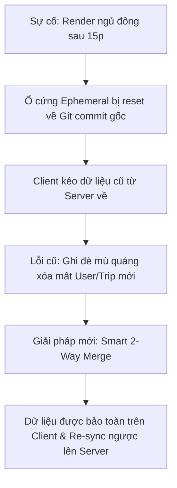
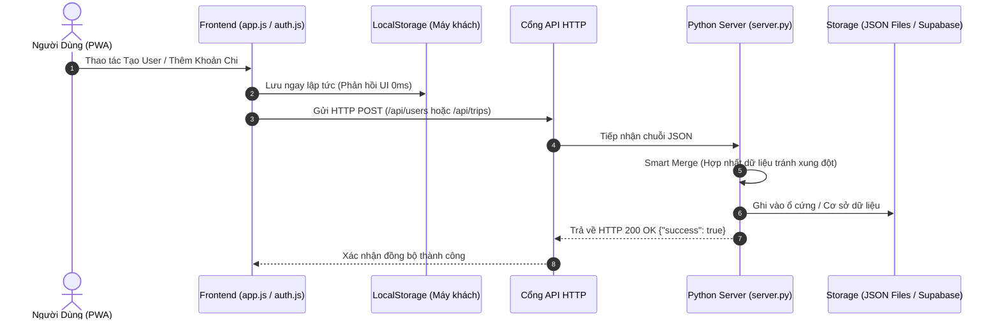

# BÁO CÁO KỸ THUẬT & ĐÁNH GIÁ VẬN HÀNH DỰ ÁN TRIPSPLIT

**Người lập:** Đội ngũ Kỹ thuật Dự án  
**Dự án:** TripSplit - Sổ Chi Tiêu & Quyết Toán Du Lịch Nhóm  
**Phiên bản mã nguồn:** v1.7.3 (Commit `2684af0`)  
**Ngày lập:** 10/09/2026  

---

## 1. TỔNG QUAN DỰ ÁN (Executive Summary)

**TripSplit** là giải pháp phần mềm quản lý tài chính và quyết toán chi tiêu nhóm theo chuẩn **PWA (Progressive Web App)**, tối ưu cho thiết bị di động (Android & iOS) và hoạt động tốt ngay cả trong điều kiện ngoại tuyến (Offline-First).

### Các năng lực cốt lõi:
1. **Chia tiền & Quỹ nhóm linh hoạt:** Hỗ trợ mô hình thủ quỹ tập trung, nộp quỹ 1-chạm, chia theo suất, chia chọn lọc hoặc theo tỷ lệ thực tế.
2. **Thuật toán tối ưu hóa nợ (Debt Minimization):** Tự động bù trừ công nợ chéo giữa các thành viên, rút gọn số lần chuyển tiền từ $N \times N$ xuống tối đa $N - 1$ giao dịch.
3. **Thanh toán VietQR chuẩn Napas 247:** Tự động sinh mã QR đúng STK ngân hàng và số tiền nợ, hỗ trợ người dùng quét mã chuyển khoản tức thì không cần gõ tay.
4. **Kiến trúc tinh gọn (Zero-Cost Architecture):** Hoạt động độc lập bằng Vanilla JS và Python Micro-Server chuẩn, không tốn phí bản quyền phần mềm hoặc framework nặng.

---

## 2. HIỆN TRẠNG & CÁC VẤN ĐỀ ĐÃ XỬ LÝ (Issues & Resolutions)

Trong quá trình vận hành thử nghiệm trên môi trường Cloud (Render Free Tier), hệ thống ghi nhận một số lỗi liên quan đến lưu trữ và đồng bộ dữ liệu. Toàn bộ các vấn đề này đã được phân tích và xử lý triệt để:

### Chi tiết các nâng cấp kỹ thuật:

| STT | Vấn đề phát sinh | Nguyên nhân kỹ thuật | Giải pháp đã triển khai |
| :---: | :--- | :--- | :--- |
| **1** | Mất tài khoản người dùng và chuyến đi sau khi tắt web | Render Free sử dụng hệ thống tệp tạm thời (*ephemeral disk*), khi ngủ đông và bật lại sẽ tải lại bản Git gốc, làm mất dữ liệu ghi trong `data/users.json`. Client cũ dùng cơ chế ghi đè thô (`this.users = serverUsers`). | Triển khai thuật toán **Smart 2-Way Merge** tại [js/auth.js](file:///Users/tuananh/AI/Project%20test/js/auth.js) và [js/app.js](file:///Users/tuananh/AI/Project%20test/js/app.js). So sánh `id` và `username`, giữ lại các bản ghi mới trên máy khách và tự động đẩy ngược (*re-sync*) lên máy chủ. |
| **2** | Lỗi 404 khi đồng bộ tài khoản | Frontend gắn tham số chống cache `?_t=${Date.now()}` vào URL, trong khi [server.py](file:///Users/tuananh/AI/Project%20test/server.py) chỉ so sánh chuỗi tĩnh `self.path == '/api/users'`. | Nâng cấp bộ phân giải URL trong Python bằng thư viện chuẩn `urllib.parse.urlparse`, bóc tách `clean_path` độc lập với Query String. |
| **3** | Không xóa triệt để dữ liệu | Khi xóa User/Trip trên máy khách, hàm hợp nhất trên server giữ lại bản ghi cũ trong tệp đĩa cứng. | Bổ sung cờ định danh trạng thái `status: 'deleted'` (Soft-Delete) giúp server loại bỏ triệt để bản ghi khỏi bộ nhớ và CSDL. |
| **4** | Thiếu khả năng giám sát vận hành | Máy chủ không có log chi tiết các thao tác ghi dữ liệu. | Tích hợp hệ thống Console Logging chuẩn: in rõ số lượng bản ghi được cập nhật, tên tệp lưu trữ và cảnh báo lỗi thời gian thực. |

---

## 3. KIẾN TRÚC KỸ THUẬT & LUỒNG DỮ LIỆU (Architecture & Data Flow)

Hệ thống được thiết kế theo mô hình **Client-Server 2 tầng linh hoạt (Dual-Storage)**:

### Các thành phần chính:
* **Tầng Client (Trình duyệt & Mobile PWA):**
  - Quản lý phiên làm việc, mã hóa thông tin người dùng trong `localStorage`.
  - Hỗ trợ Service Worker ([sw.js](file:///Users/tuananh/AI/Project%20test/sw.js)) lưu trữ tĩnh tài nguyên, đảm bảo mở app tức thì kể cả khi mất mạng.
* **Tầng Giao tiếp (API Layer):**
  - `/api/info`: Giám sát trạng thái máy chủ, IP mạng nội bộ và môi trường (Cloud/Local).
  - `/api/users`: Đồng bộ danh bạ thành viên, phân quyền Quản trị viên (Admin) và Thành viên (Member).
  - `/api/trips`: Đồng bộ danh sách chuyến đi, danh sách thành viên và các khoản chi tiêu.
* **Tầng Server & Lưu trữ:**
  - Máy chủ chạy nền bằng `server.py` trên cổng `PORT` do môi trường cấp phát.
  - Lưu trữ kép: Tệp cấu trúc JSON cục bộ kết hợp cơ chế sẵn sàng kết nối sang CSDL Cloud PostgreSQL (Supabase).

---

## 4. QUY TRÌNH TỰ ĐỘNG HÓA TRIỂN KHAI (CI/CD Pipeline)

Dự án đã thiết lập quy trình triển khai tự động hóa hoàn toàn (**Continuous Deployment - CD**) qua cơ chế Webhook giữa GitHub và Render:

$$\text{Nhà phát triển} \xrightarrow{\text{git push}} \text{GitHub Repo} \xrightarrow{\text{Webhook}} \text{Render Máy ảo} \xrightarrow{\text{Auto Deploy}} \text{Production Live}$$

1. **Kho mã nguồn:** Đặt tại GitHub repository `letuananh161096/TripSplit`.
2. **Cơ chế kích hoạt:** Mỗi khi nhánh `main` nhận commit mới, GitHub tự động gửi tín hiệu Webhook sang Render.
3. **Triển khai tự động:** Render tự động kéo mã nguồn mới nhất (`git pull`), đóng gói môi trường và tái khởi động tiến trình Python chỉ trong vòng 60 - 90 giây mà không cần thao tác quản trị viên thủ công.

---

## 5. ĐÁNH GIÁ & ĐỀ XUẤT NÂNG CẤP HẠ TẦNG (Roadmap & Recommendations)

Để ứng dụng vận hành chuyên nghiệp, bền vững cho số lượng người dùng lớn, đội ngũ kỹ thuật đề xuất lộ trình nâng cấp hạ tầng như sau:

### So sánh các phương án hạ tầng:

| Phương án | Đặc điểm kỹ thuật | Chi phí hàng tháng | Đánh giá & Khuyến nghị |
| :--- | :--- | :---: | :--- |
| **Render Free + LocalStorage** *(Hiện tại)* | Chạy máy ảo miễn phí của Render. Máy chủ ngủ sau 15p không hoạt động. Dữ liệu được bảo toàn nhờ thuật toán Smart Merge trên máy khách. | **0 VNĐ** | ✅ **Phù hợp giai đoạn thử nghiệm nội bộ, chi phí tối ưu tuyệt đối.** |
| **Render + Supabase PostgreSQL** *(Khuyên dùng ngay)* | Frontend & API chạy trên Render, toàn bộ CSDL chuyển sang PostgreSQL đám mây của Supabase (miễn phí 500MB tại Singapore). Dữ liệu tách biệt hoàn toàn với máy chủ. | **0 VNĐ** | 🌟 **Tối ưu nhất:** Đạt chuẩn ứng dụng thương mại, dữ liệu lưu trữ vĩnh viễn không phụ thuộc chu kỳ sống của Render. |
| **Thuê Cloud VPS (PA Việt Nam / Vietnix)** | 1 Máy chủ ảo Linux riêng tại Việt Nam (1 vCPU, 2GB RAM, SSD 30GB). Tốc độ mạng nội địa cực nhanh, không lo đứt cáp quang biển. | **~80.000đ - 100.000đ / tháng** | 🚀 **Khuyên dùng khi đưa vào khai thác chính thức** cho nhiều nhóm và doanh nghiệp sử dụng liên tục 24/7. |

---

## 6. KẾT LUẬN

1. Dự án **TripSplit** đã được giải quyết toàn bộ các lỗi tiềm ẩn về lưu trữ, đồng bộ và giao tiếp API.
2. Ứng dụng đã sẵn sàng phục vụ các hoạt động du lịch nhóm, quyết toán chi phí với độ tin cậy cao và tốc độ phản hồi nhanh.
3. Trong bước tiếp theo, đề xuất phê duyệt việc cấu hình CSDL **PostgreSQL Cloud (Supabase)** để hoàn thiện 100% tính bền vững của dữ liệu mà vẫn đảm bảo **chi phí duy trì 0 đồng**.
